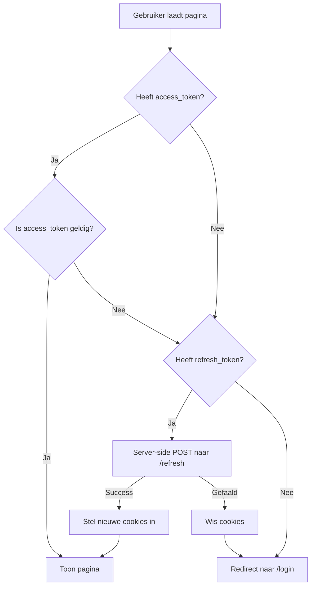

> **Partly superseded (2026-07-17).** The current design uses one refresh cookie
> at `Path=/api` and an auth-scoped `/api/auth/rehydrate` route. See `docs/INDEX.md`.


# BFF Cookie & Sessie-integratie Richtlijn voor Backend Tenants

Deze gids beschrijft de vereisten en best-practices voor frontend tenants (zoals *De Koninklijke Loop*, *C&F Bouw*, *TuinHub* en *LaventeCare*) die integreren met de **LaventeCare Auth Systems** backend. 

Het correct implementeren van deze richtlijn voorkomt dat gebruikers voortijdig worden uitgelogd of dat de backend ten onrechte een "Token Reuse Attack" (replay-aanval) signaleert.

---

## 📌 De Architectuur: BFF & Cookie-gebaseerde IAM
De backend maakt gebruik van een **Dual-Token sessiemodel** voor maximale veiligheid:
1.  **Access Token (JWT):** Short-lived (15 minuten), asymmetrisch ondertekend (`RS256`).
2.  **Refresh Token:** Long-lived (7 dagen), opaque (willekeurige string) en eenmalig bruikbaar (token rotation).

Om kwetsbaarheden zoals Cross-Site Scripting (XSS) te elimineren, worden deze tokens uitsluitend via **HttpOnly cookies** beheerd. Omdat moderne browsers third-party cookies blokkeren (SameSite restricties), maakt de frontend gebruik van een **Backend-For-Frontend (BFF) proxy**. Alle verzoeken lopen dus via het domein van de frontend zelf (same-origin).

---

## 🚨 De Valkuilen: Waarom sessies voortijdig breken

### 1. Het Serverless Set-Cookie Merging Probleem
De backend stuurt bij een succesvolle login of refresh meerdere `Set-Cookie` headers terug (om nieuwe tokens te zetten én oude paden expliciet te wissen).
*   **De valkuil:** Serverless runtimes (zoals Vercel of AWS Lambda) voegen rauwe response-headers met dezelfde naam vaak samen tot één enkele, door komma's gescheiden string in de HTTP-response.
*   **Het gevolg:** Browsers raken in de war door de komma's in de `Expires` datums (`Expires=Mon, 01-Jan-2026...`) en weigeren de cookies op te slaan. Hierdoor raakt de browser direct zijn refresh-token kwijt.
*   **De oplossing:** Gebruik altijd de native Cookies API van je framework (zoals `Astro.cookies` of `next/headers` cookies) in plaats van handmatige response-header manipulatie. Deze API's garanderen dat de adapter de headers als individuele HTTP-lijnen naar de browser stuurt.

### 2. Shadow Cookies & Token Reuse Alarms
Om security-redenen scoped de backend het `refresh_token` cookie specifiek op `/api/auth` en `/api/v1/auth`. Bij elke rotatie stuurt de backend wis-instructies (`Max-Age=-1`) voor legacy paden om "cookie shadowing" te voorkomen.
*   **De valkuil:** Als een frontend proxy alle inkomende cookie-paden herschrijft naar `Path=/`, worden wis-instructies voor specifieke paden (zoals `/api/auth`) nooit uitgevoerd. Het oude cookie blijft in de browser staan.
*   **Het gevolg:** De browser heeft nu twee cookies: één op `/` en één op `/api/auth`. Bij een volgend refresh-verzoek geeft de browser voorrang aan het cookie met het meest specifieke pad (`/api/auth`). De backend ontvangt een verouderd token dat al eens geroteerd is, detecteert dit als een diefstalpoging (Token Reuse), en **blokkeert direct de volledige sessie**.
*   **De oplossing:** Respecteer de cookie-paden die de backend terugstuurt. Zorg ervoor dat wis-instructies (`Max-Age <= 0`) met hun oorspronkelijke `Path`-attribuut naar de browser worden gestuurd.

---

## 🛠️ Code Implementatie: Astro-Voorbeeld

### 1. Cookie Parsing Helper (`src/lib/cookie-utils.ts`)
Gebruik deze functie om de inkomende `Set-Cookie` headers van de backend correct te ontleden en aan de cookies-manager van je framework door te geven:

```typescript
import type { AstroCookies } from 'astro';

export function applyCookiesToAstro(
  backendResponse: Response,
  astroCookies: AstroCookies,
  isDev: boolean
): void {
  // Haal de rauwe headers op (getSetCookie() voorkomt joinen via komma's)
  const rawRes = backendResponse as Response & { headers: { getSetCookie?: () => string[] } };
  const cookies = typeof rawRes.headers.getSetCookie === 'function'
    ? rawRes.headers.getSetCookie()
    : (backendResponse.headers.get('set-cookie') ? [backendResponse.headers.get('set-cookie')!] : []);

  cookies.forEach((cookieStr) => {
    const parts = cookieStr.split(';').map((p) => p.trim());
    if (parts.length === 0 || !parts[0]) return;

    const nameValue = parts[0];
    const equalIndex = nameValue.indexOf('=');
    if (equalIndex === -1) return;

    const name = nameValue.substring(0, equalIndex);
    const value = nameValue.substring(equalIndex + 1);

    // Haal het specifieke pad en levensduur op
    const pathMatch = cookieStr.match(/Path=([^;]+)/i);
    const path = pathMatch ? pathMatch[1].trim() : '/';

    const maxAgeMatch = cookieStr.match(/Max-Age=([^;]+)/i);
    const maxAge = maxAgeMatch ? parseInt(maxAgeMatch[1], 10) : undefined;

    // Als Max-Age <= 0 is, betreft het een wis-instructie
    if (maxAge !== undefined && maxAge <= 0) {
      astroCookies.delete(name, { path });
      return;
    }

    const isCsrf = name === 'csrf_token';
    const httpOnly = !isCsrf; // CSRF moet leesbaar zijn voor JS

    astroCookies.set(name, value, {
      path,
      httpOnly,
      sameSite: 'lax',
      secure: !isDev, // HTTPS vereist in productie
      maxAge,
    });
  });
}
```

### 2. Integratie in de BFF Proxy (`src/pages/api/[...path].ts`)
Roep de helper aan bij het forwarden van de response:

```typescript
export const ALL: APIRoute = async ({ request, params, url, cookies }) => {
  const API_URL = import.meta.env.PUBLIC_API_URL;
  const path = params.path;
  const targetUrl = `${API_URL}/api/${path}${url.search}`;

  const reqHeaders = new Headers(request.headers);
  reqHeaders.delete('host');

  const backendResponse = await fetch(targetUrl, {
    method: request.method,
    headers: reqHeaders,
    body: request.method !== 'GET' ? await request.arrayBuffer() : undefined,
  });

  const resHeaders = new Headers(backendResponse.headers);
  
  // Pas de cookies toe via de Astro API en verwijder de rauwe header
  applyCookiesToAstro(backendResponse, cookies, import.meta.env.DEV);
  resHeaders.delete('set-cookie');

  return new Response(backendResponse.body, {
    status: backendResponse.status,
    headers: resHeaders,
  });
};
```

---

## 🔄 Server-Side Rehydration (SSR Middleware)
Om te voorkomen dat server-rendered pagina's (SSR) de gebruiker direct uitloggen zodra het access-token verloopt, moet de server-middleware de sessie transparant kunnen vernieuwen op de achtergrond.

### Middleware Flowchart


### Implementatie in Middleware (`src/middleware.ts`)
```typescript
import { applyCookiesToAstro } from './lib/cookie-utils';

async function serverSideRefresh(context: any, refreshToken: string) {
  const apiUrl = import.meta.env.PUBLIC_API_URL;
  const tenantId = import.meta.env.PUBLIC_TENANT_ID;

  try {
    const response = await fetch(`${apiUrl}/api/v1/auth/refresh`, {
      method: 'POST',
      headers: {
        'Content-Type': 'application/json',
        'X-Tenant-ID': tenantId,
        'Cookie': `refresh_token=${refreshToken}`,
      },
    });

    if (!response.ok) return null;

    // Schrijf de nieuwe tokens weg in de Astro cookies context
    applyCookiesToAstro(response, context.cookies, import.meta.env.DEV);

    const newAccessToken = context.cookies.get('access_token')?.value;
    if (!newAccessToken) return null;

    const role = await decodeRole(newAccessToken);
    return { accessToken: newAccessToken, role };
  } catch (error) {
    return null;
  }
}
```
Indien de verversing slaagt, overschrijf je `context.locals.accessToken` en laat je de routebeveiliging doorgaan. Indien de verversing faalt, wis je de cookies via `context.cookies.delete(...)` en stuur je de gebruiker door naar de inlogpagina.
